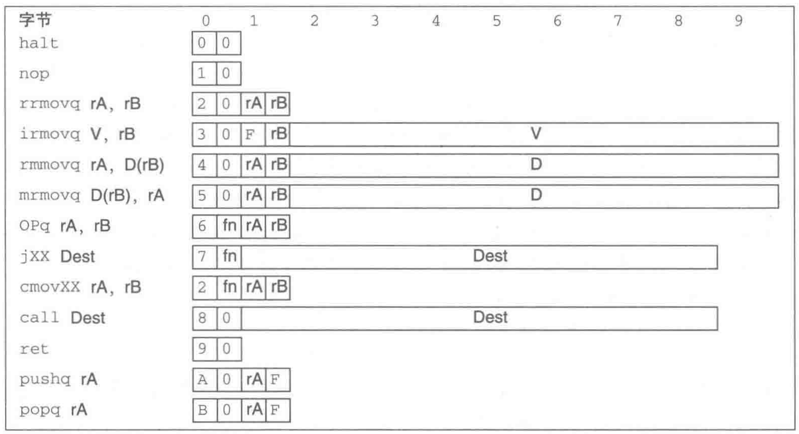
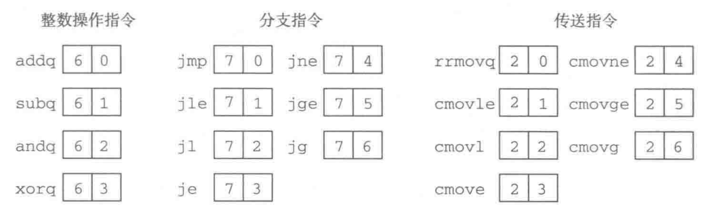
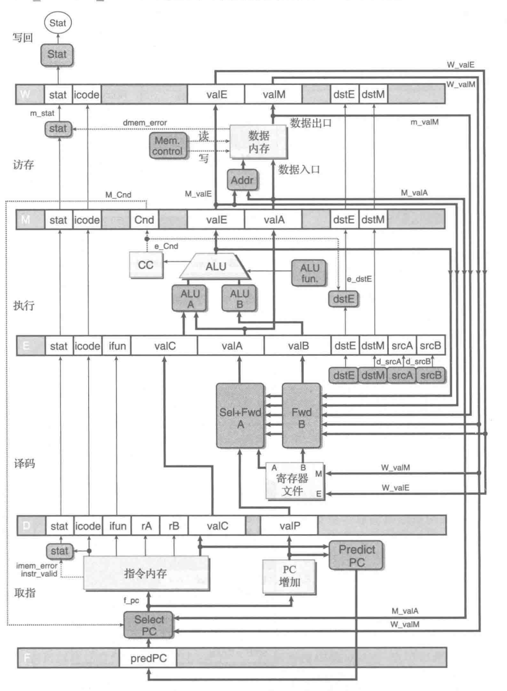

# Y86-64模拟器的实现

本模拟器在《CSAPP》上所设计的Y86-64模拟器的基础上进行扩充和实现. 

## 1. 五级流水线

### 1.1 基本指令集




### 1.2 扩充指令集


### 1.3 五级流水线结构



<br><br>

## 2. Cache

### 2.1 Cache结构

存放文件: `Cache.py` - 定义了Cache类的相关属性和方法

在Y86-64模拟器的基础上集成了**直接映射Cache**、**组相联Cache**、**全相联Cache**. 根据设置不同的`LINE, BLOCK, Group`参数得到不同种类的Cache. 其中, Cache的块替换策略采用的是**随机替换**+**LRU**相结合的替换策略. 
- Cache基本结构: 
    - `mem`: Memory主存
    - `LINE`: 行数
    - `BLOCK`: 块大小
    - `GROPU`: 组数
- 默认地址为$10$位, Cache为直接映射Cache (可设置相关参数进行调整)
    - `tagBits`: $2$位
    - `lineBits`: $4$位
    - `blockBits`: $4$位

### 2.2 Cache性能测试

存放文件: `CacheTest.py` - 利用**朴素矩阵乘法**以及**分块矩阵乘法**对其进行性能测试

运行性能测试文件: `python3 CacheTest.py [option]`
- `[option] 可选`: 
    - `--help/-h`: 相关帮助信息; 
    - `--addr=`: Memory Address Bit (Default: 20 bit); 
    - `--n=`: Scale of Matrix (Default: 100*100); 
    - `--block=`: Block Factor (Default: 25); 
    - `--CacheSize=`: Cache Size (Default: 12 bit); 
    - `--LINE=`: Cache Line (Default: 6 bit); 
    - `--BLOCK=`: Cache Block (Default: 6 bit). 
- 默认Cache为直接映射; 
- 注意: 自行设置参数时不要超过某些限制. 

1. 朴素矩阵乘法
```python
for i in range(n):
    for j in range(n):
        r = 0
        for k in range(n):
            r += A[i][k] * B[k][j]
        C[i][j] = r
```
2. 分块矩阵乘法
```python
for jj in range(0, n, block):
    for kk in range(0, n, block):
        for i in range(n):  # 行
            for j in range(jj, min(jj + block, n)):
                r = 0
                for k in range(kk, min(kk + block, n)):
                    r += A[i][k] * B[k][j]
                C[i][j] += r
```

相关测试假设: 
- 相关`int`型整数存储在内存中需要$4$字节. 

1. 改变**分块因子**

| Cache相关参数 (`LINE,GROUP,BLOCK`) |    矩阵规模    | 分块因子  | Cache命中率(朴素, 分块) | Cache失效率 |
| :-------------------------------: | :------------: | :------: | :---------------: | :--------------:|
|        $(6,0,6)\text{bit}$        | $100\times100$ |   $10$   | $52.94\%,95.27\%$ | $47.06\%,4.73\%$ |
|        $(6,0,6)\text{bit}$        | $100\times100$ |   $16$   | $52.94\%,95.18\%$ | $47.06\%,4.82\%$ |
|        $(6,0,6)\text{bit}$        | $100\times100$ |   $20$   | $52.94\%,94.21\%$ | $47.06\%,5.79\%$ |
|        $(6,0,6)\text{bit}$        | $100\times100$ |   $25$   | $52.94\%,92.41\%$ | $47.06\%,7.59\%$ |
|        $(6,0,6)\text{bit}$        | $100\times100$ |   $50$   | $52.94\%,77.22\%$ | $47.06\%,22.78\%$ |

结果分析: 
- 由上表分析可得: 分块矩阵乘法的Cache命中率始终高于朴素矩阵乘法的Cache命中率; 
- 根据Cache块大小的设置, 当分块因子小于块大小时, 此时命中率很高; 但是当分块因子大于块大小时, 命中率开始下降. 


2. 改变**Cache模拟器相关参数**

| Cache相关参数 (`LINE,GROUP,BLOCK`) |   矩阵规模   | 分块因子 | Cache命中率(朴素, 分块) | Cache失效率 |
| :-------------------------------: | :------------: | :-----: | :---------------: | :--------------:|
|        $(6,0,6)\text{bit}$        | $100\times100$ |   $10$   | $52.94\%,95.27\%$ | $47.06\%,4.73\%$ |
|        $(5,1,6)\text{bit}$        | $100\times100$ |   $10$   | $46.09\%,81.03\%$ | $53.91\%,18.97\%$ |
|        $(4,2,6)\text{bit}$        | $100\times100$ |   $10$   | $45.56\%,75.82\%$ | $54.44\%,24.18\%$ |
|        $(3,3,6)\text{bit}$        | $100\times100$ |   $10$   | $42.45\%,61.05\%$ | $57.55\%,38.95\%$ |
|        $(2,4,6)\text{bit}$        | $100\times100$ |   $10$   | $37.29\%,38.52\%$ | $38.52\%,61.48\%$ |
|        $(1,5,6)\text{bit}$        | $100\times100$ |   $10$   | $25.96\%,28.05\%$ | $74.04\%,71.95\%$ |

<br><br>

## 3. 写缓冲

存放文件`Cache.py` - 在Cache类基础上额外定义了部分属性和方法实现写缓冲区. 

在Y86-64模拟器集成Cache的基础上, 将该写缓冲区集成到Cache中. 

当程序**读取数据**时: 
1. 首先匹配Cache, 若匹配成功且有效, 直接从中读取数据即可; 
2. 若匹配失败或无效, 
    1. 首先选择从写缓冲 OR 内存中读取到的数据存放在哪一个表项; 
    1. 匹配写缓冲 OR 内存;  
    2. 将对应的数据写入到Cache块内. 

当程序**写入数据**时: 
1. 首先匹配Cache, 若匹配成功且有效, 直接向其写入数据即可, 并将该数据写入到写缓冲区; 
2. 若匹配失败或无效, 首先数据写入Cache对应的表项, 紧接着将数据写入写缓冲内; 
3. 在此之后, 写缓冲择机将数据写回到内存. 

- 写缓冲基本结构: 
    - `BufferSize`: 写缓冲容量; 
    - `buffer_data`: 存储需要被写往内存数据; 
    - `buffer_addr`: 存储需要被写往内存数据的地址; 
    - `start, end`: 双指针; 
        - `start`: 最早未写往内存的写缓冲数据的位置; 
        - `end`: 最小未使用的写缓冲的位置. 
    - `full`: 缓冲区是否已满; 
    - `t_write`: 写线程. 写缓冲择机将存储的数据希望内存; 
    - `lock`: 互斥锁. 互斥资源访问; 
    - `stop`: 信号量. 标示当将数据全部写入内存后结束线程. 
- 默认写缓冲区大小为$128\text{Bytes}$